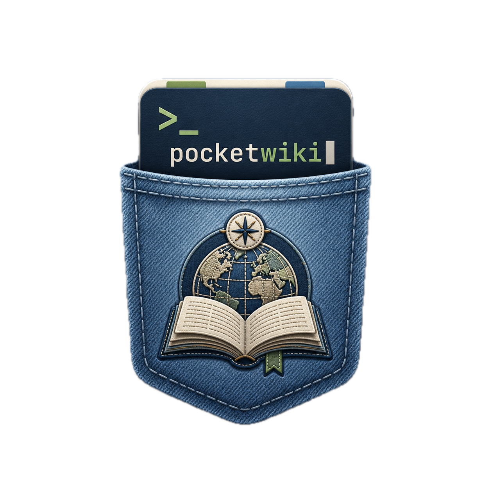

<p align="center">
  
</p>
Funcionalidades:
- Le Markdown, `.excalidraw` e `.excalidraw.md` direto do filesystem local;
- Exibe a base como wiki interativa com leitor, dashboard, mapa, saude, tempo e IA;
- Usa layout responsivo para celular, tablet, notebook e telas grandes;
- Usa icones compactos nas areas principais para reduzir ruido em telas pequenas;
- Usa IA local via LM Studio, sempre mediada pelo proxy do servidor;
- Interpreta desenhos Excalidraw como fontes visuais pesquisaveis e indexaveis.

## Base de referencia

A base fixa compartilhada fica configurada no `.env`:

```sh
POCKETWIKI_REFERENCE_PATH="/absolute/path/to/reference/wiki"
POCKETWIKI_REFERENCE_READONLY=true
```

O contrato local fica em `SKILL/connection.md`.

Existem duas formas de carregar a base:

- Base fixa no servidor: configure `POCKETWIKI_REFERENCE_PATH` no `.env`. Essa é a opção para celular/outros PCs na mesma rede, porque todos leem a wiki direto da máquina principal.
- Abertura manual: use `Abrir pasta`/`Fallback` no navegador. Nesse caso o handle fica no IndexedDB daquele navegador/dispositivo e serve como modo local/ad-hoc.

Quando rodar pelo `server.mjs` e o path do `.env` existir, ele tem prioridade como fonte compartilhada.

As APIs `/api/config` e `/api/wiki/files` releem essa configuracao durante a execucao, entao ajustes no `POCKETWIKI_REFERENCE_PATH` passam a refletir no proximo reload da pagina. O path aceita absoluto, relativo ao projeto, `~/...`, `$HOME/...`, `file://...` e espacos escapados copiados do terminal.

## Excalidraw

Arquivos `.excalidraw`, `.excalidraw.md` e Markdown gerado pelo plugin Obsidian Excalidraw entram como fontes da wiki. Ao abrir uma pagina desse tipo, a UI prioriza a aba Excalidraw; o botao `Abrir indice` força a leitura textual quando precisar ver o markdown bruto.

O fluxo atual:

- detecta cenas JSON puras de `.excalidraw`
- descompacta blocos `## Drawing` com fence `compressed-json` usando LZString
- interpreta fences `json` quando o Obsidian grava a cena sem compressao
- renderiza a cena completa em SVG com `@excalidraw/utils` (`exportToSvg`)
- no app macOS, abre um editor Excalidraw completo via `WKWebView` usando `@excalidraw/excalidraw`
- salva alterações direto na wiki local com botao Salvar, `Cmd+S` e autosave; fontes remotas ficam em modo somente leitura
- usa fallback textual quando so existem `Text Elements` disponiveis
- mostra se a visualizacao veio de `cena completa` ou `fallback textual`
- extrai textos, links, tags e relacoes por setas/bindings para busca, mapa, saude e contexto da IA

O renderer oficial web e o editor desktop ficam empacotados localmente e so carregam quando a aba Excalidraw e aberta. Para gerar ou atualizar os bundles:

```sh
npm run build:excalidraw
```

Esse comando atualiza `assets/excalidraw-renderer.js`, `assets/lz-string.min.js` e `Sources/PocketWikiMac/Resources/ExcalidrawEditor/`. Rode depois de `npm install` ou quando mexer em `src/excalidraw-renderer.js` ou `src/excalidraw-desktop/`.

O servidor tambem serve `.excalidraw` com content-type `application/vnd.excalidraw+json`, entao esses arquivos entram no mesmo fluxo de leitura, busca e indexacao dos Markdown.

## UI responsiva e atalho

A interface foi ajustada para funcionar de iPhone 13 ate ultrawide. Em telas menores, a navegacao usa botoes compactos por icone e textos reduzidos para evitar sobreposicao.

`manifest.webmanifest`, `sw.js` e `offline.html` formam a casca instalavel do PocketWiki. Se um atalho abrir enquanto o servidor local estiver indisponivel, a tela `offline.html` mostra um erro visual com acoes de retentar e copiar URL.

Esse cache e apenas da casca do app. A base compartilhada da wiki continua sendo o `POCKETWIKI_REFERENCE_PATH` no `.env`; APIs e conteudo indexado nao sao tratados como fonte persistente pelo service worker.

Para trocar o icone da sidebar depois, adicione `assets/favicon.png` ou `favicon.ico` na raiz do projeto. Sem arquivo, a UI cai no fallback `PW`.

## Setup local

Primeira instalacao ou atualizacao de dependencias:

```sh
npm install
npm run build:excalidraw
```

## Rodar no PC

O PocketWiki precisa ficar servido no PC. Deixe este comando rodando no terminal:

```sh
npm start
```

No próprio PC:

```text
http://localhost
```

Na LAN:

```text
http://pocketwiki.local
http://pokectwiki.local
```

Rotas detectadas pelo app:

```sh
curl http://localhost/api/routes
```

O boot do server tambem imprime URLs locais, LAN e Tailscale quando encontrar IP `100.x`.

O server binda em `0.0.0.0` e anuncia nomes `.local` via mDNS:

```sh
POCKETWIKI_BIND_HOST="0.0.0.0"
POCKETWIKI_PUBLIC_HOSTS="pocketwiki.local,pokectwiki.local"
POCKETWIKI_MDNS=true
```

Ao subir, o terminal imprime também URLs por IP, por exemplo:

```text
PocketWiki LAN IP: http://192.168.x.x
```

No celular, teste primeiro pelo IP. Se o IP funcionar e `.local` não, o problema é resolução mDNS da rede/cliente.

Checklist se o celular não acessar:

- PC e celular precisam estar na mesma rede/VLAN.
- No macOS, libere conexões de entrada para `node` em System Settings -> Network -> Firewall.
- Se tiver rede guest, mesh com isolamento/AP isolation ou VLAN IoT, o celular pode não alcançar o PC.
- Se `.local` falhar, use `http://IP_DO_PC` ou crie entrada DNS/hosts no roteador.
- A porta usada para URL sem porta é `80`. Se voltar para `8787`, a URL volta a precisar de `:8787`.

### Acessar sem porta

Browser so omite porta quando o servico esta em HTTP `80` ou HTTPS `443`. Registro mDNS/SRV nao faz Chrome/Safari abrirem `http://pocketwiki.local` em `8787` automaticamente.

Para LAN local sem porta:

```sh
npm start
```

O `.env` deve ter:

```sh
POCKETWIKI_PORT=80
```

Depois acesse:

```text
http://pocketwiki.local
```

Se o SO negar permissao em `:80`, rode com:

```sh
sudo env "PATH=$PATH" npm run start:lan80
```

Se nao quiser rodar Node com privilegio, mantenha `8787` e coloque um reverse proxy local em `:80` apontando para `127.0.0.1:8787` (Caddy, Nginx, Traefik ou pf no macOS).

### Tailscale

Pelo Tailscale, a URL por IP sempre funciona quando o device esta na tailnet:

```sh
tailscale ip -4
```

Exemplo de acesso:

```text
http://100.x.y.z
```

O `.local` por mDNS e multicast nao atravessa Tailscale de forma confiavel. Na tailnet, trate o IP `100.x` ou o nome MagicDNS `.ts.net` como caminho nativo.

O PocketWiki tambem lista as rotas detectadas:

```sh
curl http://localhost/api/routes
```

Exemplo de retorno:

```json
{
  "portless": true,
  "mdns": ["http://pocketwiki.local"],
  "lan": ["http://192.168.x.x"],
  "tailscale": ["http://100.x.y.z"]
}
```

Se voce preferir HTTPS pelo nome MagicDNS do Tailscale, use Tailscale Serve:

```sh
tailscale serve --bg http://127.0.0.1:80
tailscale serve status
```

Isso cria uma URL HTTPS sem porta no dominio MagicDNS/Tailscale, algo como:

```text
https://nome-da-maquina.nome-da-tailnet.ts.net
```

Nao da para fazer `pocketwiki.local` aparecer automaticamente via Tailscale MagicDNS puro. Para esse nome especifico funcionar na tailnet, use um DNS rewrite/hosts apontando `pocketwiki.local` para o IP Tailscale do PC e rode o PocketWiki em `:80`, ou use reverse proxy/DNS interno.

Caminho pratico:

```sh
tailscale ip -4
```

Pegue o IP `100.x.y.z` do PC e crie uma entrada DNS/hosts:

```text
100.x.y.z pocketwiki.local
```

Se for no celular, o mais simples costuma ser usar o nome MagicDNS `.ts.net` ou configurar esse rewrite no DNS que seus clientes usam dentro da tailnet.

## Local AI

Config do LM Studio:

```sh
LM_STUDIO_BASE_URL="http://localhost:1234/v1"
LM_STUDIO_MODEL=""
LM_STUDIO_API_KEY=""
```

Se o LM Studio exigir auth, coloque o token em `LM_STUDIO_API_KEY`. Se `LM_STUDIO_MODEL` estiver vazio, o app tenta `/v1/models` e usa o primeiro modelo carregado.

O token fica só no `.env`, que deve permanecer fora do git. O app fala com LM Studio via proxy local (`/api/ai/*`), então o token não vai para o browser.

A tela de IA consulta `/api/ai/models` e mostra os modelos carregados no LM Studio em dropdown. No chat, `Enter` envia a mensagem e `Shift+Enter` quebra linha.

## Revisao da wiki

A aba Saude tem uma area Revisao com melhorias acionaveis e um prompt dedicado em `prompts/wiki-review.md`. O botao `Copiar prompt` copia o prompt completo para usar em qualquer LLM; o botao `Revisar na IA local` manda o mesmo contexto para o modelo local configurado.

MCP note: `mcp.json` is for LM Studio/Codex tools, not for the browser app directly. The filesystem MCP path for this repo should point to:

Use o path absoluto local da sua máquina apontando para `SKILL/`.

See `mcp.example.json`.
