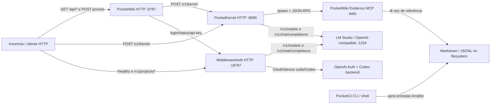
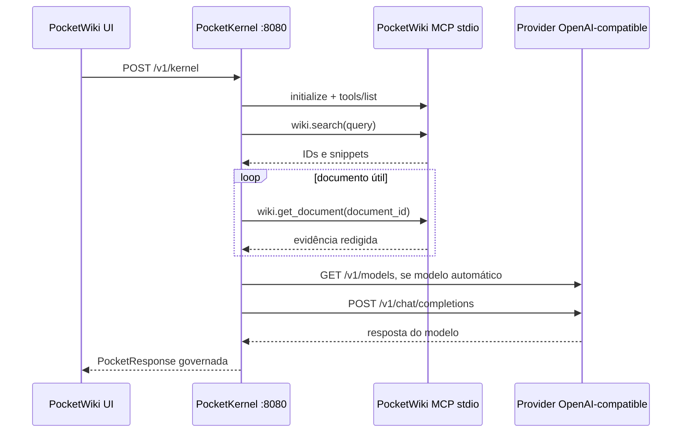
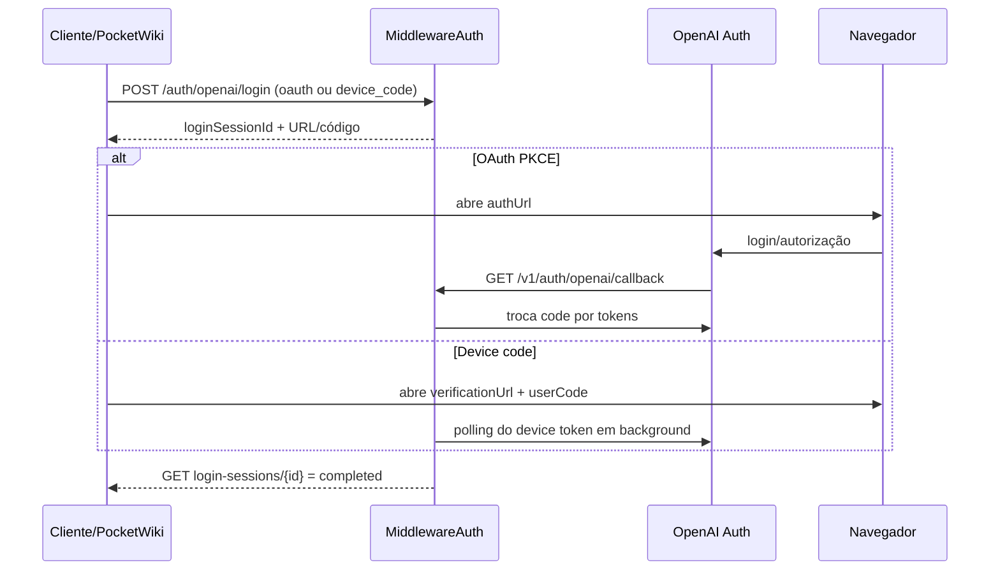
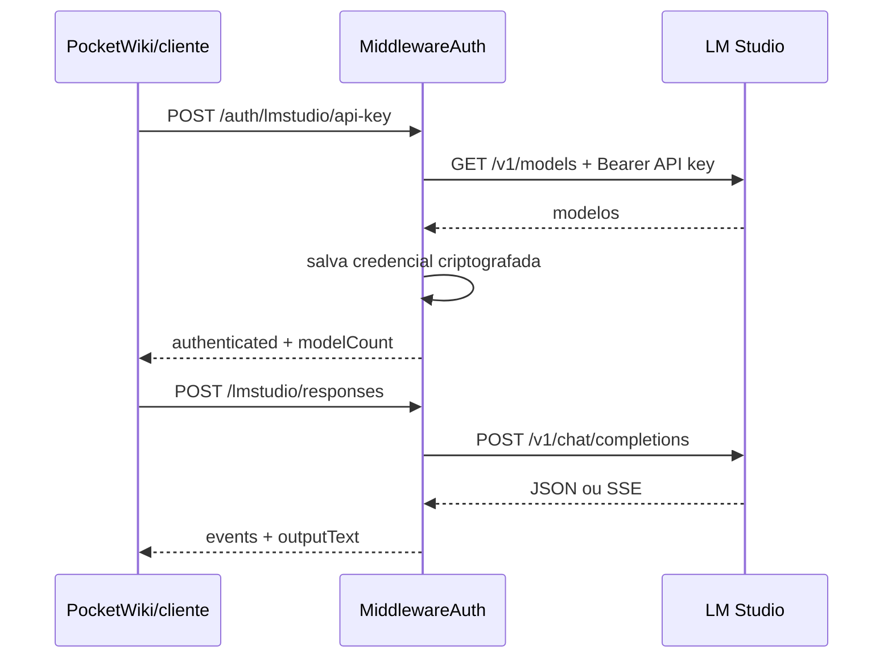

# Pocket Stack — rotas, integrações e Insomnia

Este documento descreve o comportamento implementado nos repositórios locais em 2026-06-19. RFCs e planos futuros não foram tratados como rotas existentes.

## Projetos avaliados

| Projeto | Caminho local | Papel atual | Interface externa |
|---|---|---|---|
| PocketCli | `/Users/irinery/Documents/PocketCli` | CLI/TUI, SSH, Ansible, contexto, memória e execução operacional | CLI, stdin/arquivo e filesystem; não expõe HTTP |
| PocketWiki | `/Users/irinery/Documents/pocketwiki` | UI/wiki, servidor web, proxies e servidor MCP de evidência | HTTP `:8787` e MCP stdio |
| PocketKernel | `/Users/irinery/Documents/pocketkernel` | Pipeline governado de IA, contexto, policy, prompt, modelo e ferramentas | HTTP `:8080`, CLI e adapter stdin |
| MiddlewareAuth | `/Users/irinery/Documents/middlewareAuth` | Broker local de credenciais OpenAI/LM Studio e inferência | HTTP `:18787` e MCP stdio cliente do próprio HTTP |

## Arquitetura real



O fluxo de pergunta implementado no app macOS é:



O MCP não usa porta e não passa pelo HTTP do PocketWiki. A configuração é feita por `POCKETKERNEL_WIKI_MCP_COMMAND` e `POCKETKERNEL_WIKI_MCP_ARGS`; o Kernel cria o processo sob demanda.

## Matriz de comunicação

| Origem | Destino | Transporte | Contrato real | Situação |
|---|---|---|---|---|
| PocketWiki UI/app | PocketKernel | HTTP | `POST /v1/kernel` | Implementado |
| PocketWiki HTTP | PocketKernel | HTTP proxy | `POST /api/kernel/query` → `POST /v1/kernel` | Implementado |
| PocketWiki UI/app | MiddlewareAuth | HTTP direto | login/status OpenAI e API key/status LM Studio | Implementado |
| PocketWiki HTTP | MiddlewareAuth | HTTP proxy | quatro rotas `/api/middleware/*` | Implementado |
| PocketKernel | PocketWiki | MCP stdio | `wiki.search`, `wiki.get_document` | Implementado e opcional |
| PocketKernel | LM Studio/OpenAI-compatible | HTTP | `GET /v1/models`, `POST /v1/chat/completions` | Implementado |
| MiddlewareAuth | LM Studio | HTTP | `GET /v1/models`, `POST /v1/chat/completions` | Implementado |
| MiddlewareAuth | OpenAI | HTTPS | OAuth/device code/token e Codex responses | Implementado |
| MiddlewareAuth MCP | MiddlewareAuth HTTP | MCP stdio → HTTP | tools `llm_*`, `openai_*` e `codex_responses` | Implementado, fora do Insomnia |
| PocketCli | PocketWiki | filesystem | Markdown Ansible em `~/.pocketcli/wiki/ansible/` | Implementado apenas como geração local |
| PocketWiki | PocketCli | stdin/arquivo | `skill_request`/`skill_endpoint.sh` | Não há chamada no código atual do PocketWiki |
| PocketCli | PocketKernel/MiddlewareAuth | HTTP | adapter nativo | Não implementado; só há backend por comando configurável |

## Rotas do PocketWiki

Defaults: `POCKETWIKI_BIND_HOST=0.0.0.0`, `POCKETWIKI_PORT=8787`. O servidor Node (`server.mjs`) e o servidor embutido no app macOS implementam o mesmo núcleo de API.

| Método | Rota | Função | Upstream/autenticação |
|---|---|---|---|
| GET | `/api/config` | Configuração pública, raiz da wiki e estado do MCP | Sem auth; não expõe tokens |
| GET | `/api/routes` | URLs local, mDNS, LAN e Tailscale | Sem auth |
| GET | `/api/wiki/files` | Lista arquivos e conteúdo indexável da raiz | Sem auth; sem paginação |
| GET | `/api/prompts/wiki-review` | Retorna prompt Markdown de revisão | Sem auth |
| POST | `/api/kernel/query` | Proxy transparente do corpo | `POST PocketKernel /v1/kernel`; não adiciona auth |
| POST | `/api/middleware/lmstudio/api-key` | Registra API key do LM Studio | Adiciona bearer do processo PocketWiki |
| POST | `/api/middleware/lmstudio/status` | Consulta credencial LM Studio | Converte POST externo em GET upstream |
| POST | `/api/middleware/openai/login` | Inicia login; default `device_code` | Adiciona bearer do processo PocketWiki |
| POST | `/api/middleware/openai/status` | Consulta credencial OpenAI | Converte POST externo em GET upstream |

Rotas web/estáticas: `GET /`, `GET /wiki-cockpit.html`, `GET|HEAD /offline.html`, `GET|HEAD /manifest.webmanifest`, `GET|HEAD /sw.js`, `GET|HEAD /favicon.ico`, `GET|HEAD /favicon.png` e `GET /assets/*`. O servidor embutido aceita HEAD pelos helpers de arquivo; o Node só declara HEAD nas rotas estáticas específicas.

Os proxies aceitam overrides `middlewareBaseUrl`, `projectId` e `profileId` no corpo. A policy do PocketWiki limita o MiddlewareAuth a URL local. O corpo máximo no Node é 2 MiB. Falha de rede vira `502` com erro simples, por exemplo `{"error":"middlewareauth_proxy_failed"}`.

Exemplo do proxy Kernel:

```json
{
  "text": "Qual é o status documentado do deploy?",
  "channel": "api",
  "app_id": "pocketwiki",
  "user_id": "local",
  "desired_profile": "wiki",
  "model_id": "local-model"
}
```

## Rota do PocketKernel

O adapter HTTP expõe somente:

| Método | Rota | Auth | Resultado |
|---|---|---|---|
| POST | `/v1/kernel` | Aberto por padrão; com `-require-auth`, exige apenas header `Authorization` não vazio | `PocketResponse` ou erro tipado |

Campos obrigatórios do request: `text`, `channel`, `app_id`, `user_id`. Canais válidos: `web`, `cli`, `discord`, `whatsapp`, `api`, `mcp`. Apps válidos: `pocketkernel`, `pocketwiki`, `pocketcli`, `middlewareauth`, `external`. Perfis opcionais: `fast`, `wiki`, `investigate`, `critical`.

Limites relevantes: texto de 20 mil caracteres, `user_id` de 128, `model_id` de 256, até 20 anexos e 10 MiB declarados por anexo. O adapter não recebe o conteúdo binário do anexo, só metadados.

Status mapeados pelo Kernel:

| Código de erro | HTTP |
|---|---:|
| `ERR_VALIDATION`, `ERR_RESOURCE_EXHAUSTED` | 400 |
| `ERR_FORBIDDEN`, `ERR_POLICY_DENIED` | 403 |
| `ERR_CONFLICT` | 409 |
| `ERR_DEPENDENCY_UNAVAILABLE` | 503 |
| `ERR_TIMEOUT` | 504 |
| demais erros | 500 |

Não existe `/healthz` no PocketKernel. A verificação operacional atual é chamar `/v1/kernel` com payload mínimo ou observar o processo/log.

## Rotas do MiddlewareAuth

Default: `HTTP_BIND_ADDR=127.0.0.1`, `HTTP_PORT=18787`. Exceto health e callback, todas as rotas exigem `MIDDLEWARE_CLIENT_TOKEN` por um destes headers:

```http
Authorization: Bearer <token>
```

ou:

```http
X-Middleware-Token: <token>
```

| Método | Rota | Função |
|---|---|---|
| GET | `/healthz` | Confirma o handler HTTP; não testa dependências |
| GET | `/v1/auth/openai/callback?state=&code=` | Callback público do OAuth PKCE |
| POST | `/v1/projects/{projectId}/auth/openai/login` | Inicia `oauth` ou `device_code` |
| GET | `/v1/projects/{projectId}/auth/openai/login-sessions/{id}` | Consulta sessão de login |
| GET | `/v1/projects/{projectId}/auth/openai/status?profileId=` | Consulta credencial OpenAI |
| POST | `/v1/projects/{projectId}/auth/openai/refresh?profileId=` | Renova/resolver credencial com TTL mínimo |
| POST | `/v1/projects/{projectId}/auth/lmstudio/api-key` | Valida `/v1/models` e salva API key criptografada |
| GET | `/v1/projects/{projectId}/auth/lmstudio/status?profileId=` | Consulta credencial LM Studio |
| POST | `/v1/projects/{projectId}/codex/responses?profileId=` | Inferência Codex via OAuth OpenAI |
| POST | `/v1/projects/{projectId}/lmstudio/responses?profileId=` | Inferência LM Studio via credencial salva |

`projectId` aceita `[a-zA-Z0-9_-]` com até 80 caracteres. `profileId` aceita `[a-zA-Z0-9_@.:-]` com até 120; vazio vira `default`. O body máximo padrão é 2 MiB.

Erros usam envelope:

```json
{
  "error": {
    "code": "ERR_MIDDLEWARE_UNAUTHORIZED",
    "message": "credencial interna invalida",
    "details": []
  }
}
```

### Login OpenAI



No fluxo `device_code`, o polling ocorre em goroutine e o estado fica somente na memória do processo. Reiniciar o MiddlewareAuth invalida sessões pendentes.

### Registro e uso do LM Studio



## PocketCli e interfaces não HTTP

O `scripts/skills/skill_endpoint.sh` é chamado de “endpoint” no README, mas tecnicamente é um processo local. Ele lê um arquivo JSON ou stdin, valida schema/guard rails, executa playbook Ansible e escreve uma resposta JSON em stdout. Insomnia não consegue chamá-lo sem um wrapper HTTP, que não existe hoje.

O contrato exige `request_id` UUID v4, `skill_name`, `host`, `risk_level`, `source`, `timestamp` e `params` opcional. `risk_level=destructive` é sempre bloqueado; `execute` exige `confirmation_token`. Skills mapeadas: `disk_check`, `disk_cleanup_safe`, `service_status`, `service_restart_safe`, `log_tail`.

O hook Ansible grava Markdown em `~/.pocketcli/wiki/ansible/`. Isso não entra automaticamente na raiz usada pelo PocketWiki. Para o MCP indexar esse material, `POCKETWIKI_REFERENCE_PATH` precisa apontar para uma raiz que contenha esses arquivos, ou os arquivos precisam ser sincronizados para a raiz configurada.

O `pocket ask` também não tem cliente HTTP nativo do PocketKernel/MiddlewareAuth. Ele executa comandos configurados em `POCKETCLI_LOCAL_BACKEND_CMD` ou `POCKETCLI_REMOTE_BACKEND_CMD`, enviando o prompt por stdin e variáveis de ambiente. Um wrapper pode chamar a API, mas não faz parte do código atual.

## Achados e lacunas

1. A UI do PocketWiki permite escolher `openai` ou `lmstudio`, autentica/configura o provider no MiddlewareAuth, mas `sendViaPocketKernel` envia só `text`, `channel`, `app_id` e `user_id`. Provider, `modelID`, inteligência e reasoning não chegam ao Kernel.

2. O PocketKernel não usa o MiddlewareAuth como ModelGateway. Ele chama diretamente o provider configurado em `POCKETKERNEL_LLM_BASE_URL`/flags. Portanto, autenticar OpenAI ou registrar LM Studio no MiddlewareAuth não muda sozinho o provider efetivo do Kernel.

3. O proxy `/api/kernel/query` aceita e repassa `model_id`, mas o cliente Swift direto não envia esse campo. A troca de modelo funciona pelo contrato HTTP/Insomnia, não pelo fluxo atual da UI.

4. `-require-auth` no PocketKernel só testa presença do header. `Authorization: qualquer-coisa` passa. Isso é um gate de presença, não autenticação real.

5. PocketWiki e PocketKernel não têm health endpoint dedicado. Só o MiddlewareAuth tem `/healthz`, e esse health não verifica stores ou providers.

6. O README do PocketKernel diz que o fallback padrão do LLM é `127.0.0.1:1234`; o código em `cmd/pocketkernel/main.go` cai em `http://192.168.2.20:1234` quando nenhuma variável é definida.

7. `PocketKernelClient.query` tem default `channel="app"`, que não é aceito pelo Kernel. O chamador atual passa `api`, então o fluxo principal funciona; outro chamador que usar o default recebe `ERR_VALIDATION`.

8. A integração PocketWiki → PocketCli descrita como `skill_request` não está conectada no código atual do PocketWiki. Ela existe apenas no lado PocketCli e em documentação/RFC.

9. O PocketWiki abre em `0.0.0.0:8787` por padrão e não autentica requests de entrada. Isso expõe `/api/wiki/files` e permite acionar os proxies usando as credenciais mantidas no processo do PocketWiki. Em LAN/Tailscale, a fronteira de segurança hoje é a própria rede/reverse proxy.

10. `/api/kernel/query` não encaminha nem injeta `Authorization`. Se o PocketKernel subir com `-require-auth`, o proxy do PocketWiki recebe `403` e não há configuração atual para fornecer o header.

Prioridade recomendada: proteger primeiro a API do PocketWiki ou limitar o bind; depois definir um único caminho de inferência (Kernel → MiddlewareAuth ou Kernel → provider direto) e propagar `provider/model/reasoning` da UI; por fim substituir o gate de presença do Kernel por validação real e adicionar health checks de dependências.

## Artefatos do Insomnia

Foram gerados:

| Artefato | Caminho local | Uso |
|---|---|---|
| Coleção Insomnia v4 | `/Users/irinery/Documents/PocketCli/docs/insomnia/pocket-stack.insomnia.json` | Requests executáveis, pastas e ambiente |
| OpenAPI 3.1 | `/Users/irinery/Documents/PocketCli/docs/insomnia/pocket-stack.openapi.yaml` | Design Document, schemas e documentação no Insomnia |
| Guia curto | `/Users/irinery/Documents/PocketCli/docs/insomnia/README.md` | Importação e ordem de teste |

No Insomnia, use **Import > File**. O JSON cria a coleção pronta; o YAML cria o Design Document. As variáveis sensíveis começam vazias:

```text
middleware_client_token
pocketkernel_bearer_token
lmstudio_api_key
```

As URLs default da coleção são:

```text
pocketwiki_base_url     http://127.0.0.1:8787
pocketkernel_base_url   http://127.0.0.1:8080
middleware_base_url     http://127.0.0.1:18787
lmstudio_base_url       http://127.0.0.1:1234
```

Fluxo mínimo de validação:

1. `MiddlewareAuth /healthz`.
2. `MiddlewareAuth LM Studio — registrar API key` e `status`.
3. `PocketKernel — query governada`.
4. `PocketWiki — /api/config` e `proxy → PocketKernel`.
5. Se usar OpenAI, inicie device code, abra a URL, copie `loginSessionId` para o ambiente e consulte a sessão.

## Fontes de implementação

- PocketWiki: `server.mjs`, `PocketWikiHTTPServer.swift`, `PocketKernelClient.swift`, `MiddlewareAuthClient.swift`, `LocalAIChatSession.swift` e `src/mcp/*`.
- PocketKernel: `kernel/http.go`, `types/envelopes.go`, `types/validate.go`, `cmd/pocketkernel/main.go`, `model/openai.go` e `ctxgw/mcp_adapter.go`.
- MiddlewareAuth: `internal/httpapi/server.go`, `routes_*.go`, `internal/codex/types.go`, `internal/lmstudio/transport.go` e `internal/config/config.go`.
- PocketCli: `scripts/skills/*`, `lib/ansible_wiki_hook.sh`, `internal/backend/backend.go` e `cmd/pocket/ai_commands.go`.
- Formatos suportados pelo Insomnia: documentação oficial de import/export do Kong e Insomnia 13.0.1 instalado localmente.

Referências externas: [repositório do Insomnia](https://github.com/Kong/insomnia), [formatos de import/export](https://developer.konghq.com/insomnia/import-export/) e [importação de OpenAPI como Design Document](https://developer.konghq.com/how-to/import-an-api-spec-as-a-document/).
